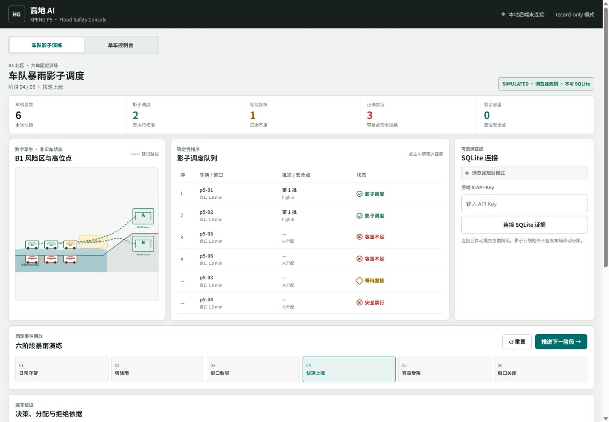
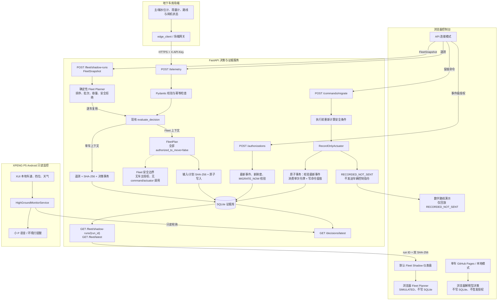

# 高地 AI · XPENG P5 暴雨风险控制台

面向地下车库暴雨内涝的可运行安全决策原型：默认首页可回放六车 Fleet Shadow 演练，场端 API 可接收遥测、计算 Go / No-Go 并保存 SQLite 证据；P5 车端提供只读状态和座舱提醒。



> 重要边界：后端、数据库、API、授权和命令留痕均可在本地运行；默认车辆适配器为 `record-only`，不会向任何真实车辆发送控制指令。Fleet Shadow 请求不接受车主授权字段，也不进入命令或执行器链路。接入实车必须取得制造商官方 SDK/API、车辆授权、封闭场地许可，并完成独立安全壳和功能安全验证。本仓库不伪造小鹏车辆控制接口，也未验证真实 P5、停车场、传感器或训练模型。

## 评审证据入口

- [Fleet Shadow 六车评审流程](./docs/DEMO.md#fleet-shadow-六车评审流程)：共享六阶段暴雨场景、确定性排队/容量拒绝、浏览器模拟与 FastAPI/SQLite 证据分层，以及可复现的 run ID 和双 SHA-256。
- [系统架构图](#系统结构)：场端、浏览器、FastAPI/SQLite 证据链与 P5 只读端的 Mermaid 数据流，并明确画出当前不存在的车辆执行链路。
- [两分钟暴雨全流程 Demo](./docs/DEMO.md)：固定 120 秒时间线、一键脚本、逐步断言、带事件链 ID 与 SHA-256 的脱敏 HTTP 运行记录；[v1.2.0 Release](https://github.com/zijin1337/xpeng-highground-ai/releases/tag/v1.2.0) 提供 MP4、manifest 和 evidence 下载。
- [可复现 Benchmark](./docs/BENCHMARK.md)：9 个单车场景覆盖全部 7 个决策码，六车场景覆盖全部 6 个阶段，并报告限定在本机 TestClient + 临时 SQLite 的 p50/p95。
- [现有方案与小鹏能力对比](./docs/competition-comparison.md)：地磁、人工通知、传统闸门、泊车能力、涉水边界及官方资料来源。
- [传感器与边缘网关成本模型](./docs/cost-model.md)：内部预算假设下，单站 3 年 TCO 为 `¥77,200`、10 站为 `¥924,000`；逐项 BOM、算式、未计价项和正式 RFQ 条件均可复核。

## 现在真正可运行的部分

- 默认 Fleet Shadow 仪表盘回放 6 辆车、6 个不可变阶段，展示风险、排序、批次、高位点、容量不足和窗口关闭；筛选只改变呈现，不改变规划结果。
- 浏览器 Fleet Planner 与 Python Fleet Planner 共享同一 JSON 场景及确定性规则，并由跨语言投影测试逐阶段校验一致。
- `POST /api/v1/fleet/shadow-runs` 原子保存 FleetSnapshot、逐车 FleetPlan、输入 SHA-256 和计划 SHA-256；同一快照重试可幂等读取，内容冲突返回 `409`。
- Fleet Shadow 的所有 `authorized_to_move` 均为 `false`；`SCHEDULED_SHADOW` 只表示影子排程，不表示车辆获准移动。
- `POST /api/v1/telemetry` 接收 HTTP 传感器与车辆状态遥测。
- Pydantic 在入口校验范围、类型、时区和标识符，非法输入返回 `422`。
- SQLite 使用 WAL、外键和事务保存原始输入、SHA-256、决策、授权和命令记录。
- `message_id` 提供内容校验后的幂等写入；相同载荷重试不会重复产生事件，不同载荷复用同一 ID 会返回 `409`。
- 服务端策略独立于传感器输入，终端不能自行修改禁行阈值。
- 决策顺序固定为：移动中异常 → 物理安全闸 → 水位禁行 → 多源一致性 → 最晚安全启动窗口。
- `MIGRATE_NOW` 事件可签发短时、事件绑定、只能使用一次的授权令牌。
- 命令执行前再次用原始遥测做安全计算，并拒绝过期、已被同场站同车辆新遥测取代的事件和复用令牌。
- 显式提供的 `captured_at` 必须满足 `HIGHGROUND_CAPTURE_MAX_AGE_SECONDS` 与 `HIGHGROUND_CAPTURE_FUTURE_TOLERANCE_SECONDS`；服务端生成的兼容时间戳不改变旧版幂等重试语义。
- 最新决策超过 `HIGHGROUND_EVENT_MAX_AGE_SECONDS` 后返回 `410 Gone`，不会把历史结果继续伪装成实时状态。
- `record-only` 适配器会将通过校验的命令写入数据库，但明确标记 `RECORDED_NOT_SENT`；无效或过期授权令牌在执行器调用前即被拒绝。
- 浏览器可输入 API Key 连接同源后端；“运行决策”会把遥测写入本地 SQLite，并显示服务端事件号和 SHA-256。
- 对 `MIGRATE_NOW` 事件，浏览器可在车主勾选单次授权后调用后端授权与命令 API；默认结果为 `RECORDED_NOT_SENT`，命令已写库但未发送任何车辆控制指令。
- 浏览器路线动画只在收到 `RECORDED_NOT_SENT + record-only` 后解锁，并始终标注为数字路线演示；它不表示实车已经移动。
- P5 Android 应用只轮询最新决策。XUI 车速、挡位和天气状态只在车机本地用于展示与提醒，不作为场端遥测上传。
- 提供边缘采集客户端、Docker、健康检查、OpenAPI 文档以及前后端自动测试。

## 系统结构



图中没有从 P5/XUI 指向 `/telemetry` 的连线，也没有从 `RecordOnlyActuator` 指向车辆执行器的连线。Fleet Planner 只写 FleetPlan/SQLite，并由 `Fleet 安全边界` 明确终止，不连接授权、命令或执行器。这些缺失是当前实现的明确边界，不是省略。

## Fleet Shadow 六车证据

从仓库根目录运行六个阶段的 API/SQLite 证据生成器：

```powershell
.\.venv\Scripts\python.exe demo\run_fleet_scenario.py --output demo\artifacts\latest-fleet-evidence.json
```

运行器会刷新时间戳，通过 FastAPI 提交全部 6 个 FleetSnapshot，逐阶段比对期望投影，再从 SQLite 读取每个 run ID、输入 SHA-256 和计划 SHA-256。最终还会断言 `fleet_runs=6`、`fleet_vehicle_plans=36`、`authorizations=0`、`commands=0`，并把 `vehicle_command_transmitted` 固定为 `false`。输出不包含 API Key 或授权令牌。

默认网页在两种证据状态之间明确区分：

| 页面状态 | 标签和证据 | 含义 |
|---|---|---|
| 未连接 API | `SIMULATED · 浏览器规划 · 不写 SQLite`；run ID/哈希显示破折号 | JavaScript 本地规划，只用于可解释回放 |
| API 已连接并提交 | `SIMULATED · SQLite 证据`；显示真实 `fleet_` run ID 与两项 SHA-256 | 本机 FastAPI/SQLite 持久化结果 |
| API 断开或阶段已变化 | `SQLite 证据已过期 · 待提交新快照` | 保留上一份服务端结果，但不与当前浏览器计划混合 |

六车数据来自仓库内置的模拟 JSON，并非真实 P5、真实停车场或现场传感器采集，也不使用训练模型。完整评审路径见 [Demo 文档](./docs/DEMO.md#fleet-shadow-六车评审流程)。

## 方式一：Docker 启动

### Windows 双击启动

确保 Docker Desktop 已运行，然后双击仓库根目录的 `start-highground.cmd`。脚本会构建并启动服务、等待健康检查通过，再自动打开浏览器。首次本地演示可在页面输入：

```text
X-API-Key: change-this-before-deploy
```

需要停止时，双击 `stop-highground.cmd`。

### 命令行启动

复制环境变量模板，并务必修改 API Key：

```bash
cp .env.example .env
```

启动：

```bash
docker compose --env-file .env up --build
```

打开：

- 操作界面：`http://127.0.0.1:8000/`
- OpenAPI/Swagger：`http://127.0.0.1:8000/docs`
- 健康检查：`http://127.0.0.1:8000/healthz`

在界面的“后端 X-API-Key”中填写 `.env` 里的 `HIGHGROUND_API_KEY`，点击“连接本地后端”。连接成功后，“运行决策”会写入本地 SQLite，而不是只运行浏览器内算法。

要验证完整后端安全链路：选择“暴雨快速上涨” → 点击“运行决策” → 勾选“车主确认本次单次授权” → 点击“验证一次性授权并记录命令”。页面会调用两个本地 API、重新执行安全校验，并显示“命令已写入本地 SQLite · 未发送车辆”。

停止：

```bash
docker compose down
```

数据库默认持久化到 `./data/highground.db`。

## 方式二：本地 Python 启动

```bash
python -m venv .venv
```

Windows PowerShell：

```powershell
.\.venv\Scripts\Activate.ps1
pip install -r backend\requirements-dev.txt
$env:HIGHGROUND_API_KEY = "replace-with-a-long-random-value"
$env:HIGHGROUND_ACTUATOR_MODE = "record-only"
uvicorn backend.app.main:app --host 127.0.0.1 --port 8000 --reload
```

macOS/Linux：

```bash
source .venv/bin/activate
pip install -r backend/requirements-dev.txt
export HIGHGROUND_API_KEY="replace-with-a-long-random-value"
export HIGHGROUND_ACTUATOR_MODE="record-only"
uvicorn backend.app.main:app --host 127.0.0.1 --port 8000 --reload
```

## 两分钟暴雨 Demo

Windows 下从仓库根目录运行：

```powershell
.\demo\run_demo.ps1 -TimeScale 1
```

脚本会启动本地 FastAPI，按 `0 / 20 / 45 / 70 / 85 / 90 / 105 / 115 / 120` 秒执行遥测、授权、命令留痕和证据查询，并断言最终为 `NO_GO`。快速回归可用 `-TimeScale 0`。完整时间线、录屏口径与证据字段见 [Demo 文档](./docs/DEMO.md)；已核验成片和脱敏运行记录见 [v1.2.0 GitHub Release](https://github.com/zijin1337/xpeng-highground-ai/releases/tag/v1.2.0)。

## 发送一条本地 HTTP 遥测

仓库自带的边缘客户端使用 Python 标准库，不需要额外依赖：

```bash
python backend/edge_client.py \
  --api-url http://127.0.0.1:8000 \
  --api-key replace-with-a-long-random-value \
  --file backend/examples/rising-water.json
```

连续发送 10 个样本，并让水位每次增加 `0.4 cm`：

```bash
python backend/edge_client.py \
  --api-key replace-with-a-long-random-value \
  --repeat 10 \
  --interval 2 \
  --rise-per-sample 0.4
```

真实水位计或雨量计只需将自身读数映射到同一 JSON 契约，再通过 HTTPS 调用遥测接口。示例载荷位于 `backend/examples/rising-water.json`。

## 核心 API

| 方法 | 路径 | 作用 | 是否需要 API Key |
|---|---|---|---|
| `GET` | `/healthz` | 服务和数据库健康检查 | 否 |
| `GET` | `/api/v1/policy` | 查看服务端安全策略 | 否 |
| `GET` | `/api/v1/session` | 验证 API Key 与运行模式 | 是 |
| `POST` | `/api/v1/telemetry` | 写入遥测并生成决策 | 是 |
| `POST` | `/api/v1/fleet/shadow-runs` | 写入六车快照并生成影子计划 | 是 |
| `GET` | `/api/v1/fleet/shadow-runs/{run_id}` | 按 run ID 读取不可变 FleetPlan 证据 | 是 |
| `GET` | `/api/v1/fleet/latest` | 按 `site_id` 读取最新 FleetPlan | 是 |
| `GET` | `/api/v1/decisions/latest` | 查询车辆最新决策 | 是 |
| `GET` | `/api/v1/events` | 查询车辆事件历史 | 是 |
| `GET` | `/api/v1/events/{event_id}` | 获取完整遥测与证据链 | 是 |
| `POST` | `/api/v1/authorizations` | 为可迁移事件签发一次性授权 | 是 |
| `POST` | `/api/v1/commands/migrate` | 重新校验并记录迁移命令 | 是 |

请求头：

```text
X-API-Key: replace-with-a-long-random-value
```

完整字段、示例和可交互请求见 `/docs`。

Fleet API 状态语义：新建快照返回 `201`；内容相同的 `snapshot_id` 重试返回 `200`；同 ID 不同内容返回 `409`；不存在的 run ID 或场站最新结果返回 `404`；最新结果超过新鲜度窗口返回 `410`；字段、时区、范围或采集时间无效返回 `422`。认证失败统一返回 `401`。

## 决策模型

时间窗口：

```text
T_last = T_threshold - T_route - T_queue - T_buffer
```

- `T_threshold`：当前水位按上涨速度到达禁行阈值的剩余时间。
- `T_route`：按封闭场地 `≤5 km/h` 估算的干燥路线时间。
- `T_queue`：多车分批放行的排队时间。
- `T_buffer`：定位、闸机、路径和通信的不确定性余量。

只要路线见水、出口受阻、车内有人、充电未断开、车辆故障、定位/通信/人工兜底失效或水触触发，结果均为 No-Go。安全闸优先级高于时间窗口和车主授权。

## 授权与命令安全

1. 只有决策为 `MIGRATE_NOW`、仍在新鲜度窗口内且仍是同场站同车辆最新结果的事件才能申请授权。
2. 授权令牌使用安全随机数生成，数据库只保存 SHA-256。
3. 令牌绑定单个事件、短时过期、只能消费一次。
4. 命令前重新计算安全条件并检查事件新鲜度；事务内再次检查最新事件身份。
5. 消费令牌与写入 `record-only` 命令记录在同一 SQLite 事务中完成，任一步失败都会回滚。
6. 默认适配器只记录命令，不向车辆发送任何数据。
7. `HIGHGROUND_ACTUATOR_MODE=disabled` 可完全关闭命令入口。

生产部署还必须增加 TLS、密钥托管、设备证书或 mTLS、细粒度身份授权、速率限制、集中日志、备份和数据库迁移。MVP 的 API Key 机制不应直接视为量产认证方案。

## 自动测试

后端测试覆盖：

- API Key 拒绝与认证会话；
- 正常遥测写入、最新决策查询与陈旧结果 `410`；
- `message_id` 相同载荷幂等与不同载荷冲突；
- 传感器冲突和关闭的安全窗口；
- No-Go 不可授权；
- `MIGRATE_NOW` → 一次性授权 → 命令留痕；
- 已被新遥测取代的事件不能授权或记录命令；
- 授权令牌不能重复使用，命令写库失败不会提前消费令牌；
- SQLite 请求连接会在操作后显式关闭；
- SQLite 事件历史持久化；
- 两分钟固定 Demo 的完整 HTTP、授权、`RECORDED_NOT_SENT` 和令牌脱敏流程；
- 9 场景 Benchmark 矩阵对全部决策码的合同覆盖与百分位报告结构；
- 六车六阶段 Python/JavaScript 投影一致性、SQLite 幂等/冲突/回滚、Fleet API 新鲜度与认证合同；
- Fleet Shadow 证据生成器的 6 个 run、36 个逐车计划、零授权/零命令断言；
- Fleet Benchmark 六阶段正确性与第 4 阶段本地 API 延迟报告结构。

运行全部测试：

```bash
npm test
python -m pytest backend/tests -q
python -m benchmarks.run_benchmark --iterations 50 --warmups 3
python demo/run_fleet_scenario.py --output demo/artifacts/latest-fleet-evidence.json
```

GitHub Actions 会同时运行 JavaScript 决策测试和 Python API/数据库测试。

## 项目结构

```text
xpeng-highground-ai/
├─ backend/
│  ├─ app/
│  │  ├─ main.py               # FastAPI、认证、API 和静态页面
│  │  ├─ decision_engine.py    # 服务端确定性安全引擎
│  │  ├─ fleet_models.py       # FleetSnapshot / FleetPlan 契约
│  │  ├─ fleet_planner.py      # 六车排序、容量、批次与安全拒绝
│  │  ├─ database.py           # 单车/Fleet SQLite 事务、幂等与证据
│  │  ├─ actuator.py           # 默认不发送车辆指令的安全适配层
│  │  ├─ models.py             # Pydantic 输入输出契约
│  │  └─ config.py             # 服务端策略与环境配置
│  ├─ edge_client.py           # 传感器/网关 HTTP 客户端
│  ├─ examples/                # 可发送的遥测样本
│  └─ tests/                   # API、数据库与引擎测试
├─ src/
│  ├─ app.js                   # UI、API 连接和本地降级演示
│  ├─ decision-engine.js       # 浏览器内解释型引擎
│  ├─ fleet-planner.js         # 与 Python 对齐的确定性 Fleet Planner
│  ├─ fleet-scenario.js        # 共享六阶段 JSON 加载与校验
│  ├─ fleet-view-state.js      # API 证据、新鲜度与请求竞态状态
│  └─ fleet-view.js            # Fleet 仪表盘回放、筛选和 API 协调
├─ demo/
│  ├─ scenarios/fleet-rainstorm-v1.json  # 六车六阶段共享场景
│  ├─ run_fleet_scenario.py              # FastAPI/SQLite 证据运行器
│  └─ ...                                # 既有两分钟单车 Demo
├─ benchmarks/                 # 确定性场景矩阵、本地延迟工具与参考报告
├─ docs/                       # Demo、Benchmark、竞品对比与成本模型
├─ p5-headunit/                # 面向 P5 XUI 的 Android 只读监控与座舱提醒工程
├─ Dockerfile
├─ docker-compose.yml
├─ index.html
└─ styles.css
```

## GitHub Pages 与可运行后端的区别

GitHub Pages 地址只能运行静态界面和浏览器演示，因为 Pages 不能运行 Python 或 SQLite。Fleet 页面在这种状态下只显示 `SIMULATED · 浏览器规划 · 不写 SQLite`，不会伪造 run ID 或 SHA-256。要使用 Fleet/单车后端 API、数据库、授权和命令接口，必须用 Docker/本地 Python 启动本仓库，或把容器部署到支持后端服务的平台。

## 小鹏 P5 车端

[`p5-headunit/`](./p5-headunit/) 是独立 Android 工程，按 Open-Xpeng 社区 P5 XUI SDK
`1.0.2` 的类定义编译。工程实现了监听车速、原始挡位码和天气事件、轮询本后端最新决策，以及调用小 P 语音和环境灯提醒的代码路径。最新决策过期时会清除陈旧卡片并等待新遥测，但不会把“数据未知”当成风险解除；风险灯意图会本地锁存，并在持续监控服务重建后尝试恢复。XUI 运行时或系统权限不可用时会明确降级并定期重新探测，不会崩溃或伪造成功。
车端拒绝后端重定向和未知决策码，避免 API Key 泄露或把不兼容响应误判为安全状态。
车速、挡位和天气事件不离开 Android 应用，也不会被该工程 POST 到场端遥测接口。当前只能确认 JVM 单元测试、APK 构建和 Android Lint 已通过；尚未完成 P5 实车/Xmart OS 白名单验证，因此不把上述代码路径表述为已在车机运行。

```powershell
cd p5-headunit
.\gradlew.bat :app:testDebugUnitTest :app:assembleDebug :app:lintDebug
```

完整构建、安装、联调和上车验证说明见 [`p5-headunit/README.md`](./p5-headunit/README.md)。

## 车辆自动移动接入还缺什么

仓库故意没有虚构“小鹏车辆移动 API”。真正接车至少需要：

1. 小鹏或车辆制造商正式授权的 SDK/API、证书和车辆绑定流程；
2. 可审计的车辆状态、充电互锁、乘员检测、定位、远程急停接口；
3. 认证封闭 ODD、干燥路线、高位点和场端闸机协议；
4. 独立安全壳，而不是由风险模型直接控制执行器；
5. HIL、封闭场地、故障注入、回归和功能安全验证；
6. 保险、隐私、网络安全、数据留存和事故责任流程。

拿到官方接口规范后，仍需实现 `VehicleActuator` 协议，并完成上述授权、互锁、安全壳、HIL 和封闭场地验证；全部验收通过后才可评估替换 `RecordOnlyActuator`。在此之前，系统会明确拒绝声称已控制真实车辆。

## 许可证

代码以 [MIT License](./LICENSE) 发布。开源许可证不免除任何车辆安全、法规、隐私和授权责任。
