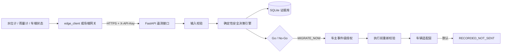

# 高地 AI（XPENG HighGround）

暴雨内涝场景下的车辆安全位移可运行 MVP。仓库现在不仅包含交互界面，还包含真实可启动的后端服务：接收传感器遥测、写入 SQLite、生成 Go/No-Go、保存完整证据链、签发事件级一次性授权，并通过安全适配层记录迁移命令。


> 重要边界：后端、数据库、API、授权和命令留痕均可真实运行；默认车辆适配器为 `record-only`，不会向任何真实车辆发送控制指令。接入实车必须取得制造商官方 SDK/API、车辆授权、封闭场地许可，并完成独立安全壳和功能安全验证。本仓库不伪造小鹏车辆控制接口。

## 现在真正可运行的部分

- `POST /api/v1/telemetry` 接收 HTTP 传感器与车辆状态遥测。
- Pydantic 在入口校验范围、类型、时区和标识符，非法输入返回 `422`。
- SQLite 使用 WAL、外键和事务保存原始输入、SHA-256、决策、授权和命令记录。
- `message_id` 提供幂等写入；边缘网关重试不会重复产生事件。
- 服务端策略独立于传感器输入，终端不能自行修改禁行阈值。
- 决策顺序固定为：移动中异常 → 物理安全闸 → 水位禁行 → 多源一致性 → 最晚安全启动窗口。
- `MIGRATE_NOW` 事件可签发短时、事件绑定、只能使用一次的授权令牌。
- 命令执行前再次用原始遥测做安全计算，并拒绝过期事件和复用令牌。
- `record-only` 适配器会将通过校验的命令写入数据库，但明确标记 `RECORDED_NOT_SENT`。
- 浏览器可输入 API Key 连接同源后端；“运行决策”会把遥测真实写入 SQLite，并显示服务端事件号和 SHA-256。
- 对 `MIGRATE_NOW` 事件，浏览器可在车主勾选单次授权后调用真实授权与命令 API；默认结果为 `RECORDED_NOT_SENT`，命令已写库但没有发车。
- 提供边缘采集客户端、Docker、健康检查、OpenAPI 文档以及前后端自动测试。

## 系统结构



## 方式一：Docker 启动

### Windows 双击启动

确保 Docker Desktop 已运行，然后双击仓库根目录的 `start-highground.cmd`。脚本会构建并启动服务、等待健康检查通过，再自动打开浏览器。首次本地演示可在页面输入：

```text
X-API-Key: change-this-before-deploy
```

需要停止时，双击 `stop-highground.cmd`。

### 命令行启动

复制环境变量模板，并务必修改 API Key：

```bash
cp .env.example .env
```

启动：

```bash
docker compose --env-file .env up --build
```

打开：

- 操作界面：`http://127.0.0.1:8000/`
- OpenAPI/Swagger：`http://127.0.0.1:8000/docs`
- 健康检查：`http://127.0.0.1:8000/healthz`

在界面的“后端 X-API-Key”中填写 `.env` 里的 `HIGHGROUND_API_KEY`，点击“连接真实后端”。连接成功后，“运行决策”会写入数据库，而不是只运行浏览器内算法。

要验证完整安全链路：选择“暴雨快速上涨” → 点击“运行决策” → 勾选“车主确认本次单次授权” → 点击“验证一次性授权并记录命令”。页面会调用两个真实 API、重新执行安全校验，并显示“命令已真实写入 SQLite · 未发送车辆”。

停止：

```bash
docker compose down
```

数据库默认持久化到 `./data/highground.db`。

## 方式二：本地 Python 启动

```bash
python -m venv .venv
```

Windows PowerShell：

```powershell
.\.venv\Scripts\Activate.ps1
pip install -r backend\requirements-dev.txt
$env:HIGHGROUND_API_KEY = "replace-with-a-long-random-value"
$env:HIGHGROUND_ACTUATOR_MODE = "record-only"
uvicorn backend.app.main:app --host 127.0.0.1 --port 8000 --reload
```

macOS/Linux：

```bash
source .venv/bin/activate
pip install -r backend/requirements-dev.txt
export HIGHGROUND_API_KEY="replace-with-a-long-random-value"
export HIGHGROUND_ACTUATOR_MODE="record-only"
uvicorn backend.app.main:app --host 127.0.0.1 --port 8000 --reload
```

## 发送一条真实 HTTP 遥测

仓库自带的边缘客户端使用 Python 标准库，不需要额外依赖：

```bash
python backend/edge_client.py \
  --api-url http://127.0.0.1:8000 \
  --api-key replace-with-a-long-random-value \
  --file backend/examples/rising-water.json
```

连续发送 10 个样本，并让水位每次增加 `0.4 cm`：

```bash
python backend/edge_client.py \
  --api-key replace-with-a-long-random-value \
  --repeat 10 \
  --interval 2 \
  --rise-per-sample 0.4
```

真实水位计或雨量计只需将自身读数映射到同一 JSON 契约，再通过 HTTPS 调用遥测接口。示例载荷位于 `backend/examples/rising-water.json`。

## 核心 API

| 方法 | 路径 | 作用 | 是否需要 API Key |
|---|---|---|---|
| `GET` | `/healthz` | 服务和数据库健康检查 | 否 |
| `GET` | `/api/v1/policy` | 查看服务端安全策略 | 否 |
| `GET` | `/api/v1/session` | 验证 API Key 与运行模式 | 是 |
| `POST` | `/api/v1/telemetry` | 写入遥测并生成决策 | 是 |
| `GET` | `/api/v1/decisions/latest` | 查询车辆最新决策 | 是 |
| `GET` | `/api/v1/events` | 查询车辆事件历史 | 是 |
| `GET` | `/api/v1/events/{event_id}` | 获取完整遥测与证据链 | 是 |
| `POST` | `/api/v1/authorizations` | 为可迁移事件签发一次性授权 | 是 |
| `POST` | `/api/v1/commands/migrate` | 重新校验并记录迁移命令 | 是 |

请求头：

```text
X-API-Key: replace-with-a-long-random-value
```

完整字段、示例和可交互请求见 `/docs`。

## 决策模型

时间窗口：

```text
T_last = T_threshold - T_route - T_queue - T_buffer
```

- `T_threshold`：当前水位按上涨速度到达禁行阈值的剩余时间。
- `T_route`：按封闭场地 `≤5 km/h` 估算的干燥路线时间。
- `T_queue`：多车分批放行的排队时间。
- `T_buffer`：定位、闸机、路径和通信的不确定性余量。

只要路线见水、出口受阻、车内有人、充电未断开、车辆故障、定位/通信/人工兜底失效或水触触发，结果均为 No-Go。安全闸优先级高于时间窗口和车主授权。

## 授权与命令安全

1. 只有决策为 `MIGRATE_NOW` 且仍在新鲜度窗口内的事件才能申请授权。
2. 授权令牌使用安全随机数生成，数据库只保存 SHA-256。
3. 令牌绑定单个事件、短时过期、只能消费一次。
4. 命令前重新计算安全条件，并检查事件新鲜度。
5. 默认适配器只记录命令，不向车辆发送任何数据。
6. `HIGHGROUND_ACTUATOR_MODE=disabled` 可完全关闭命令入口。

生产部署还必须增加 TLS、密钥托管、设备证书或 mTLS、细粒度身份授权、速率限制、集中日志、备份和数据库迁移。MVP 的 API Key 机制不应直接视为量产认证方案。

## 自动测试

后端测试覆盖：

- API Key 拒绝与认证会话；
- 正常遥测写入与最新决策查询；
- `message_id` 幂等；
- 传感器冲突和关闭的安全窗口；
- No-Go 不可授权；
- `MIGRATE_NOW` → 一次性授权 → 命令留痕；
- 授权令牌不能重复使用；
- SQLite 事件历史持久化。

运行全部测试：

```bash
npm test
python -m pytest backend/tests -q
```

GitHub Actions 会同时运行 JavaScript 决策测试和 Python API/数据库测试。

## 项目结构

```text
xpeng-highground-ai/
├─ backend/
│  ├─ app/
│  │  ├─ main.py               # FastAPI、认证、API 和静态页面
│  │  ├─ decision_engine.py    # 服务端确定性安全引擎
│  │  ├─ database.py           # SQLite 事务、幂等、证据与授权
│  │  ├─ actuator.py           # 默认不发送车辆指令的安全适配层
│  │  ├─ models.py             # Pydantic 输入输出契约
│  │  └─ config.py             # 服务端策略与环境配置
│  ├─ edge_client.py           # 传感器/网关 HTTP 客户端
│  ├─ examples/                # 可发送的遥测样本
│  └─ tests/                   # API、数据库与引擎测试
├─ src/
│  ├─ app.js                   # UI、API 连接和本地降级演示
│  └─ decision-engine.js       # 浏览器内解释型引擎
├─ Dockerfile
├─ docker-compose.yml
├─ index.html
└─ styles.css
```

## GitHub Pages 与真实后端的区别

GitHub Pages 地址只能运行静态界面和浏览器演示，因为 Pages 不能运行 Python 或 SQLite。要使用真实遥测、数据库、授权和命令接口，必须用 Docker/本地 Python 启动本仓库，或把容器部署到支持后端服务的平台。

## 实车接入还缺什么

仓库故意没有虚构“小鹏车辆移动 API”。真正接车至少需要：

1. 小鹏或车辆制造商正式授权的 SDK/API、证书和车辆绑定流程；
2. 可审计的车辆状态、充电互锁、乘员检测、定位、远程急停接口；
3. 认证封闭 ODD、干燥路线、高位点和场端闸机协议；
4. 独立安全壳，而不是由风险模型直接控制执行器；
5. HIL、封闭场地、故障注入、回归和功能安全验证；
6. 保险、隐私、网络安全、数据留存和事故责任流程。

拿到官方接口规范后，只需实现 `VehicleActuator` 协议，并在独立安全验证通过后替换 `RecordOnlyActuator`。在此之前，系统会明确拒绝声称已控制真实车辆。

## 许可证

代码以 [MIT License](./LICENSE) 发布。开源许可证不免除任何车辆安全、法规、隐私和授权责任。
