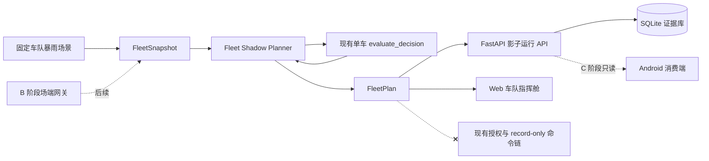

# 高地 AI v1.3 车队影子演练设计

- 日期：2026-07-23
- 状态：概念设计已确认，等待书面规格复核
- 当前实施范围：A 阶段，评审演示闭环
- 后续独立范围：B 阶段场端工程、C 阶段 Android 消费端

## 1. 背景

当前仓库已经提供可靠的单车确定性安全 MVP：FastAPI 接收遥测，SQLite 保存输入、决策、授权和命令留痕，Web 控制台展示 Go/No-Go，Android P5 工程只读轮询最新结果。真实车辆适配器仍为 `record-only`，不会向车辆发送控制指令。

《物理 AI 概念提案》进一步提出动态风险图、多车风险排序、坡道吞吐、高位车位容量和分批迁移。仓库目前只用固定的 `queue_ahead` 参数近似排队时间，没有车队快照、容量分配、逐车计划或车队回放。因此，提案中最有辨识度的车-场-云协同尚未形成可运行证据。

大赛完整方案阶段截至 2026-08-16。当前可用资源是电脑和普通 Android 环境，没有真实 P5 控制接口、停车场、液位计或企业数据渠道。2026-07-23 当天只能修改 GitHub 仓库内容。基于这些约束，本设计将工作拆为 A、B、C 三个独立子项目，当前只实施可在 GitHub 上完整验证的 A 阶段。

## 2. 决策摘要

A 阶段发布一个车队影子演练：同一场站快照包含共享场端状态和多台车辆遥测；纯函数规划器复用现有单车决策引擎，按最晚安全启动窗口排序，分配高位安全点与批次，并把容量不足、窗口关闭和安全闸失败作为可解释的正确拒绝结果。

Web 默认提供“车队影子演练”视图，同时保留原单车控制台。GitHub Pages 使用浏览器内确定性规划器，仅做模拟；连接 FastAPI 后，每个快照与逐车计划写入 SQLite，并返回运行 ID 与 SHA-256 证据。整个车队流程始终是影子计划，不签发车主授权，不调用命令接口，也不触发车辆执行器。

## 3. 目标

1. 用 6 台车辆、6 个阶段的固定暴雨场景展示守望、准备、复核、影子调度、容量不足和正确禁行。
2. 复用现有单车 Go/No-Go 逻辑，不在车队层复制另一套安全判断。
3. 用确定性规则完成风险排序、批次计算和安全点容量分配，相同输入始终产生相同计划。
4. 静态浏览器演示与后端持久化演示使用同一场景和预期结果。
5. 保存可追溯的车队输入哈希、规划器版本、逐车结果和拒绝原因。
6. 定义 B 阶段网关输入与 C 阶段 Android 输出可沿用的稳定契约。
7. 保持现有单车 API、授权链、命令留痕、Android 工程和自动测试不回归。

## 4. 非目标

1. 不接入或虚构小鹏私有车辆控制 API。
2. 不把影子调度结果送入现有授权或 `/commands/migrate` 接口。
3. 不声称使用真实停车场、液位计、P5 实车或雨季数据完成验证。
4. 不训练机器学习模型；v1.3 使用可解释的确定性规划规则。
5. 不在 A 阶段实现 MQTT、真实网关驱动、连续时间序列或 Android 新界面。
6. 不修改用户提供的 DOCX；本次交付仅修改 GitHub 仓库。
7. 不将接口预留表述为 B、C 阶段已经实现。

## 5. 分阶段边界

### 5.1 A 阶段：车队影子演练

当前设计和下一份实施计划只覆盖 A 阶段：车队快照、确定性规划器、FastAPI/SQLite 证据、Web 风险图与调度队列、固定回放场景、自动测试和仓库文档。

### 5.2 B 阶段：场端工程

B 阶段另立规格，接入站点配置、网关健康、传感器观测时间、事件流与影子模式数据。它沿用 `FleetSnapshot`，但需要独立处理设备身份、断点续传、时钟偏差、离线缓存和连续运行验证。

### 5.3 C 阶段：Android 消费端

C 阶段另立规格，让普通 Android 环境读取车队最新摘要、展示本车状态、触发分级提醒并清除过期结果。它不上传 XUI 状态，不控制车辆，也不把普通 Android 验证表述成 P5 实车验证。

## 6. 系统架构



`Fleet Shadow Planner` 是纯领域逻辑，不访问数据库、网络或 UI。它调用现有单车决策引擎，并在单车结果之上增加排序、容量和批次分配。FastAPI 负责认证、幂等、持久化与读取；Web 负责场景推进和展示；固定 JSON 场景负责跨语言合同测试。

## 7. 数据契约

### 7.1 FleetSnapshot

```text
FleetSnapshot
├─ snapshot_id: Identifier
├─ site_id: Identifier
├─ captured_at: timezone-aware datetime
├─ source_mode: SIMULATED | SHADOW
├─ site
│  ├─ observed_at: timezone-aware datetime
│  ├─ gateway_online: boolean
│  ├─ batch_size: integer
│  ├─ batch_interval_min: number
│  └─ safe_points[]
│     ├─ safe_point_id: Identifier
│     ├─ label: string
│     ├─ priority: integer
│     ├─ capacity: integer
│     └─ available: boolean
└─ vehicles[]
   ├─ telemetry: 现有 TelemetryIn
   ├─ danger_water_level_cm: number | null
   └─ route_distance_m: number | null
```

约束如下：

- `vehicles` 长度为 1 到 50；v1.3 固定演示使用 6 台。
- 车辆 ID 在快照内必须唯一，所有 `telemetry.site_id` 必须等于快照 `site_id`。
- `danger_water_level_cm` 和 `route_distance_m` 可以为 `null`；为空时分别回退到服务端策略的禁行水位和路线距离。
- `SIMULATED` 表示仓库固定场景或浏览器生成数据；`SHADOW` 表示外部系统提供但只用于计划的数据。
- 不定义 `LIVE_CONTROL`。提交未知来源模式返回 `422`。
- 服务端使用现有采集时间窗口检查快照、场端观测和每台车辆遥测的新鲜度。
- `batch_size`、`batch_interval_min`、安全点容量和车型阈值都有明确上下限。
- 安全点按 `priority` 升序、再按 `safe_point_id` 字典序稳定排列。

### 7.2 FleetPlan

```text
FleetPlan
├─ run_id
├─ snapshot_id
├─ site_id
├─ source_mode
├─ planner_version
├─ created_at
├─ duplicate
├─ input_sha256
├─ plan_sha256
├─ summary
│  ├─ vehicle_count
│  ├─ scheduled_count
│  ├─ verify_count
│  ├─ denied_count
│  └─ remaining_capacity
└─ vehicles[]
   ├─ vehicle_id
   ├─ base_decision: 现有 DecisionOutput
   ├─ allocation_status
   ├─ rank
   ├─ batch_index
   ├─ queue_ahead
   ├─ safe_point_id
   ├─ action_permission: NONE | SHADOW_ONLY | DENIED
   └─ reason
```

`allocation_status` 只使用以下值：

| 状态 | 含义 |
|---|---|
| `NOT_REQUIRED` | 单车结果为 `STAY` 或 `WATCH`，继续守望 |
| `PREPARE_ONLY` | 单车结果为 `PREPARE`，不占用安全点 |
| `VERIFY_ONLY` | 证据不足或冲突，等待复核 |
| `SCHEDULED_SHADOW` | 已分配影子批次和安全点，但无车辆执行权限 |
| `NO_CAPACITY` | 风险需要迁移，但没有可用安全点 |
| `WINDOW_CLOSED` | 排队时间使最晚安全启动窗口关闭 |
| `SITE_UNAVAILABLE` | 网关离线或场端观测过期，禁止形成调度计划 |
| `DENIED` | 单车结果为 `NO_GO` 或 `EMERGENCY_STOP` |

任何车队计划中的 `authorized_to_move` 都保持为 `false`。只有 `SCHEDULED_SHADOW` 使用 `SHADOW_ONLY`，需要安全拒绝的结果使用 `DENIED`，其他守望、准备和复核状态使用 `NONE`。

## 8. 确定性调度算法

1. 校验快照结构、时间、场站一致性、车辆唯一性和安全点配置。结构错误使整个请求失败，不做部分写入。
2. 如果网关离线或场端观测过期，仍返回有效计划，但所有原本可能调度的车辆标记为 `SITE_UNAVAILABLE`。
3. 为每台车创建车辆专属 `DecisionPolicy`，只覆盖 `danger_water_level_cm`、`route_distance_m`、`queue_ahead=0`、场站批次参数，其余沿用服务端策略。
4. 调用现有 `evaluate_decision(..., owner_authorized=False)` 生成基础单车结果。
5. `STAY`、`WATCH`、`PREPARE`、`VERIFY_ONLY`、`NO_GO` 和 `EMERGENCY_STOP` 直接映射为非调度状态。只有 `MIGRATE_NOW` 进入候选集合。
6. 候选按 `latest_safe_start_min` 从小到大排序；相同窗口按 `vehicle_id` 字典序排序。
7. 依次分配排序后的可用安全点。安全点总容量用尽后，其余候选标记为 `NO_CAPACITY`。
8. 对已分配候选计算 `queue_ahead` 与批次：`batch_index = floor(queue_ahead / batch_size) + 1`。
9. 使用实际 `queue_ahead` 再次调用单车决策引擎。如果排队后结果不再是 `MIGRATE_NOW`，标记为 `WINDOW_CLOSED`，释放安全点且不把释放位置自动交给窗口更差的车辆；这样避免二次重排产生难以解释的级联结果。
10. 成功分配的候选标记为 `SCHEDULED_SHADOW`，记录排名、批次和安全点，但不调用授权、命令或执行器。
11. 对规范化输入和最终计划分别计算 SHA-256；输出记录固定 `planner_version = "fleet-shadow-v1"`，保证回放可追溯。规范化使用现有 canonical JSON 规则：对象键排序、紧凑分隔符、UTF-8 编码。`plan_sha256` 的输入排除 `run_id`、`created_at`、`duplicate` 和 `plan_sha256` 本身，使相同车队输入的核心计划哈希稳定。

不自动补位是 v1.3 的刻意选择。它让一次排序和一次复核形成稳定、易审计的结果；更复杂的迭代优化属于 B 阶段真实运营设计。

## 9. API

所有新接口位于现有 `/api/v1` 下并沿用 `X-API-Key`。

| 方法 | 路径 | 行为 |
|---|---|---|
| `POST` | `/api/v1/fleet/shadow-runs` | 校验快照、生成并原子保存计划 |
| `GET` | `/api/v1/fleet/shadow-runs/{run_id}` | 读取指定影子运行及逐车结果 |
| `GET` | `/api/v1/fleet/latest?site_id=...` | 读取场站最新且未过期的计划 |

幂等规则与现有遥测一致：

- 首次提交返回 `201`。
- 相同 `snapshot_id` 与相同规范化内容重复提交返回原 `run_id`、`duplicate=true` 和 `200`。
- 相同 `snapshot_id` 对应不同内容返回 `409`。
- 不存在的运行返回 `404`。
- 最新运行超过现有事件新鲜度上限后返回 `410`，不会伪装为实时状态。

浏览器静态模式不调用这些接口，也不生成伪造的服务器运行 ID 或哈希。只有 API 模式显示持久化证据。

## 10. 持久化

在现有 SQLite 初始化中新增两张表：

### 10.1 fleet_runs

保存 `run_id`、`snapshot_id`、`site_id`、来源模式、采集时间、接收时间、规划器版本、规范化输入 JSON、输入 SHA-256、计划 JSON 和重复标志所需索引。`snapshot_id` 唯一。

### 10.2 fleet_vehicle_plans

以 `(run_id, vehicle_id)` 为主键，保存基础单车结果 JSON、分配状态、排名、批次、排队数、安全点、权限和原因。外键级联关联 `fleet_runs`。

快照、车队计划和逐车结果在同一事务中写入。任何一步失败都回滚。数据库继续使用 WAL、外键和请求级连接关闭规则。

## 11. Web 体验

### 11.1 信息架构

页面头部新增分段标签：`单车控制台` 与 `车队影子演练`。评审入口默认显示车队视图，原单车功能完整保留。

车队视图包含：

1. 左侧车队摘要：车辆总数、影子调度、等待复核、正确禁行与安全点剩余容量。
2. 中央车库风险图：水位区域、车辆位置、建议路线和高位安全点；明确标注“数字孪生，非实车状态”。
3. 右侧调度队列：排名、窗口、批次、安全点和状态。
4. 底部事件回放：固定 6 阶段，可重置或逐步推进。
5. 逐车证据表：基础决策、车队分配、关键依据和动作权限。

### 11.2 交互规则

- 页面加载后显示容量受限的固定车队场景，使第一屏同时出现可调度、复核和正确禁行。
- “推进下一阶段”加载同一场景的下一份不可变快照。
- 点击车辆只筛选证据，不直接编辑该车辆的安全输入。
- 浏览器模式运行 JavaScript 规划器，并始终显示 `SIMULATED` 与“不写 SQLite”。
- API 模式提交快照；只有成功响应可以更新运行 ID 和输入哈希。
- 输入或场景变化会推进请求代次，使旧响应失效，沿用现有前端竞态防护模式。
- API 失联时保留最后一次结果供阅读，但立即标记为过期，不把本地新结果和旧服务器证据混合。

### 11.3 响应式与可访问性

桌面端使用摘要、风险图、队列三栏。窄屏按摘要、队列、风险图、时间线、证据的顺序堆叠。固定风险图高度与队列行高，动态状态不能造成布局跳动。状态同时使用文字、图标和颜色，不依赖红绿区分；表格在窄屏可横向滚动，不遮挡按钮或正文。

## 12. 错误处理与安全边界

| 情况 | 处理 |
|---|---|
| JSON、枚举、范围或时间格式非法 | `422`，不写入任何表 |
| 任一车辆 ID 重复或场站不一致 | `422`，整批拒绝 |
| 相同快照 ID 内容冲突 | `409` |
| 指定运行不存在 | `404` |
| 最新计划过期 | `410` |
| 数据库或规划器内部异常 | 事务回滚，返回服务器错误，不保留半份证据 |
| 网关离线或观测过期 | `200/201` 有效计划，车辆状态为 `SITE_UNAVAILABLE` |
| 路线见水或安全闸失败 | 有效 `DENIED` 结果并保留证据 |
| 安全点容量不足 | 有效 `NO_CAPACITY` 结果 |
| 后端断开 | Web 显示离线/过期，不把浏览器结果伪装成后端证据 |

车队 API 不接受车主授权字段。规划器模块不依赖 actuator，API 代码也不调用 `/authorizations` 或 `/commands/migrate`。测试会用执行器替身证明车队流程不会触发执行器。

## 13. 固定演练场景

新增 `demo/scenarios/fleet-rainstorm-v1.json`，包含 6 台车辆和 6 个不可变阶段：

1. 日常守望：全部 `STAY`。
2. 强降雨：部分 `WATCH`。
3. 窗口收窄：出现 `PREPARE_ONLY`。
4. 快速上涨：两车 `SCHEDULED_SHADOW`，一车 `VERIFY_ONLY`，一车因路线见水 `DENIED`。
5. 容量受限：至少一车 `NO_CAPACITY`。
6. 窗口关闭：晚批车辆 `WINDOW_CLOSED`，已见水车辆继续 `DENIED`。

每个阶段固化完整输入和预期摘要、逐车决策、分配状态、排名、批次与安全点。Python 和 JavaScript 测试读取同一文件，任何语言实现偏离预期都失败。

## 14. 模块与文件边界

新增模块：

- `backend/app/fleet_models.py`：车队输入输出 Pydantic 契约。
- `backend/app/fleet_planner.py`：纯确定性规划算法。
- `src/fleet-planner.js`：静态浏览器规划器。
- `src/fleet-view.js`：车队视图渲染、回放与 API 协调。
- `demo/scenarios/fleet-rainstorm-v1.json`：跨语言固定场景。
- 相应 Python、Node 与 API 测试文件。

修改现有文件：

- `backend/app/database.py`：新增表、幂等保存和查询方法。
- `backend/app/main.py`：注册三个车队 API，不修改现有路由语义。
- `index.html`、`styles.css`、`src/app.js`：加入分段视图并保持单车行为。
- `README.md`、`docs/DEMO.md`、`docs/BENCHMARK.md`：说明新能力和证据边界。
- `.github/workflows/test.yml` 仅在现有命令无法覆盖新测试时调整。

不在 `src/app.js` 内实现车队规划细节，也不在 API 路由内实现排序算法。这样领域逻辑可独立测试，UI 与持久化可以分别演进。

## 15. 测试策略

### 15.1 Python 单元测试

- 混合决策映射正确。
- 最晚窗口排序和车辆 ID 平局规则确定。
- 安全点优先级、容量与批次分配正确。
- 排队后二次计算可产生 `WINDOW_CLOSED`。
- 网关离线、观测过期、路线见水和容量不足均为安全拒绝。
- 相同输入重复运行产生相同非时间字段和相同规范化哈希。

### 15.2 API 与数据库测试

- API Key、`201/200/409/404/410/422` 合同。
- 快照幂等、冲突、事务回滚和跨进程持久化。
- 最新计划查询与陈旧计划处理。
- 逐车计划与运行记录外键一致。
- 车队请求不会调用车辆执行器。

### 15.3 JavaScript 与跨语言合同测试

- JavaScript 规划器读取同一 6 阶段场景并满足全部断言。
- Python 与 JavaScript 对摘要、逐车决策、分配状态、排名和批次输出一致。
- 场景切换、请求代次、离线标记和证据来源标签不回归。

### 15.4 回归与视觉检查

- 现有 `npm test` 全部通过。
- 现有后端测试和 Benchmark 全部通过。
- 现有 Android JVM 测试、APK 构建和 Lint 不因 A 阶段改动而失败。
- 在桌面和手机宽度检查车队页面截图，确认无重叠、裁切、空白风险图或不可读状态。
- 运行固定场景的快速回放，输出包含运行 ID、哈希、逐车结果和全部断言的证据 JSON。

## 16. A 阶段完成标准

A 阶段只有同时满足以下条件才算完成：

1. 6 车 6 阶段场景在浏览器模式和 API 模式均可运行。
2. 混合状态、容量不足和窗口关闭在页面与证据中可见。
3. SQLite 可读取指定运行和场站最新运行。
4. 浏览器模拟与持久化证据标签不可混淆。
5. 车队流程没有车主授权、命令记录或执行器调用。
6. Node、Python、Benchmark 和 Android 既有检查通过。
7. 桌面与窄屏页面通过视觉检查。
8. README、Demo 和 Benchmark 文档不夸大模拟、硬件或实车能力。

## 17. 实施顺序

1. 建立固定场景、Pydantic 契约和纯 Python 规划器。
2. 完成规划器单元测试和边界条件。
3. 扩展 SQLite 与 FastAPI，完成幂等、读取和 API 测试。
4. 实现 JavaScript 规划器并通过同一场景合同。
5. 实现车队 Web 视图、回放和 API 模式。
6. 补充快速证据回放、文档和视觉检查。
7. 运行完整回归，确认单车与 Android 现有能力不受影响。

完成 A 阶段后，再分别为 B、C 编写独立设计和实施计划。
